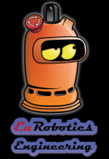
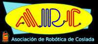

# Source code of Grosnik & Seskäpa robots

Grosnik & Seskäpa were made for Eurobot 2014, theme *Prehistorbot*. 

 

# More info

Check out more photos and videos of our robots at our [web page](http://arc-robots.org/fotos#2014).

# Authors

* Silvia Santano
* Javier Rodriguez Puigvert
* Javier Baliñas Santos

# Copyright

# License

This program is free software; you can redistribute it and/or modify it under the terms of the GNU General Public License as published by the Free Software Foundation; either version 2 of the License, or (at your option) any later version.

This program is distributed in the hope that it will be useful, but WITHOUT ANY WARRANTY; without even the implied warranty of MERCHANTABILITY or FITNESS FOR A PARTICULAR PURPOSE.  See the GNU General Public License for more details.

You should have received a copy of the GNU General Public License along with this program; if not, write to the Free Software Foundation, Inc., 59 Temple Place, Suite 330, Boston, MA  02111-1307  USA
